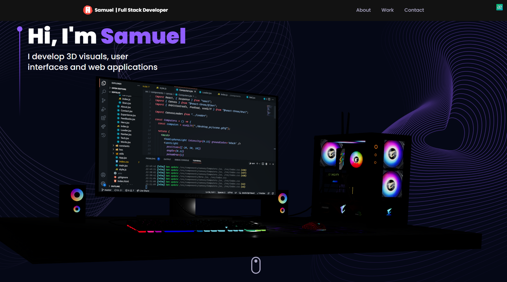

# TreeDFolio

<p align="center">
  <a href="https://fullcycle.com.br/" target="_blank">
    
  </a>
</p>

<h4 align="center" >🚀 🟪 TreeDFolio 🟪 🚀</h4>

<h4 align="center">
  This application is a conclusion of my study about 3d Rendering and animations with NextJS
</h4>

#

<p align="center">
  |&nbsp;&nbsp;
  <a style="color: #8a4af3;" href="#project">Overview</a>&nbsp;&nbsp;&nbsp;|&nbsp;&nbsp;&nbsp;
  <a style="color: #8a4af3;" href="#techs">Technologies</a>&nbsp;&nbsp;&nbsp;|&nbsp;&nbsp;&nbsp;
  <a style="color: #8a4af3;" href="#app">Project</a>&nbsp;&nbsp;&nbsp;|&nbsp;&nbsp;
  <a style="color: #8a4af3;" href="#run-project">Run</a>&nbsp;&nbsp;&nbsp;|&nbsp;&nbsp;
  <a style="color: #8a4af3;" href="#author">Author</a>&nbsp;&nbsp;&nbsp;|&nbsp;&nbsp;&nbsp;
</p>

#

<h1 align="center">
  
  <a href="https://github.com/Samuel-Ricardo">
    
  </a>

  <a herf="https://www.instagram.com/samuel_ricardo.ex/">
     
  </a>

  <a herf='https://www.linkedin.com/in/samuel-ricardo/'>
     
  </a>

</h1>

<br>

<p id="project"/>

<br>

<h2>  | :artificial_satellite: About:  </h2>

<p align="justify">
In this project, the target is to build a website that explore the real time 3D Rendering and 3D Effects using NextJS and improve all tech skills related to website animations.
</p>

<p align="justify">
For this, i build a Dev Portfolio website, that you can use as a template, because i can apply all features and visual designs and animations that i have in mind.
</p>

<br>

📡 | Hosted on Vercel: [ https://tree-d-folio.vercel.app/ ]

<br>

#

<br>

<h2 id="techs">
  :building_construction: | Technologies and Concepts Studied:
</h2>

> <a href='https://nextjs.org/'>  </a>

- Three
- NextJS
- TailwindCSS
- Typescript
- Docker
- EmailJS
- Framer Motion
- eslint
- Prettier
- husky
- lint-staged

> Among Others...

#

<br>

<h2 id="app">
  💻 | Application:
</h2>

<p align="justify">
This Portfolio show the highlights of a developer, social media, and some projects with a call to action in the end of the page. Parallax, drawn, fade in, are some of animations here. This project have a module system with email sending, form validations and more.
</p>

<br>

<video width="100%" controls>
  <source src="./readme_assets/demo.mp4" type="video/mp4">
</video>

<br>
<br>

<p align="justify">
*Remember this software runs on free machines, that is, with the minimum of resources to fit into free plans, so with scarce resources in the production environment these were the results I obtained
</p>

<br/>

 

<br>

  <p>
    Loading 3D models can be difficult for the browser, but once loaded, the site runs smoothly
  </p>

<br>
<br>

📡 | Hosted on Vercel: [ https://tree-d-folio.vercel.app/ ]

<br>
<br>

<h2 id="run-project"> 
   👨‍💻 | How to use
</h2>

<br>

### Open your Git Terminal and clone this repository

```git
  $ git clone "git@github.com:Samuel-Ricardo/TreeDFolio.git"
```

### Make Pull

```git
  $ git pull "git@github.com:Samuel-Ricardo/TreeDFolio.git"
```

<br>

This application use `Docker` so you dont need to install and cofigurate anything other than docker on your machine.

> <a target="_blank" href="https://www.docker.com/">  </a>

<br>

Navigate to project folder `$ cd ./treedfolio/` and run it using `docker-compose`

```bash

  # After setup docker environment just run this commmand on root project folder:

  $ docker-compose up --build   # For First Time run this command

  $ docker-compose up           # to run project


```

```bash

  #Apps Running on:

  $ APP: http://localhost:3000

  See more: ./treedfolio/docker-compose.yaml

```

<br>

#

<br>

<h2 id="author">
  :octocat: | Author:  
</h2>
